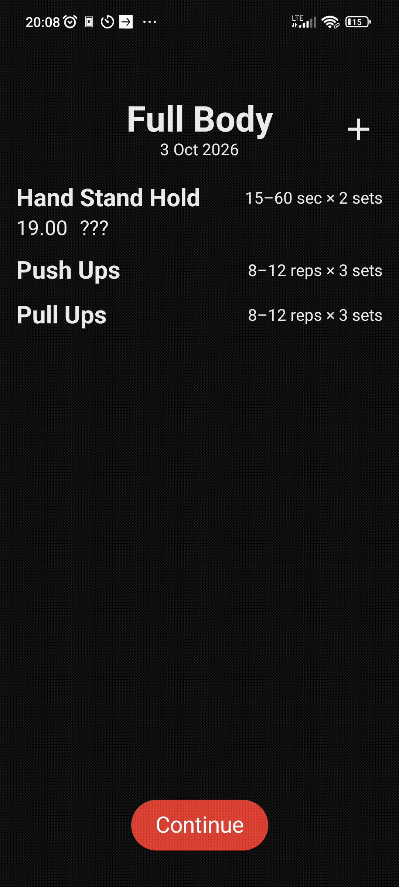
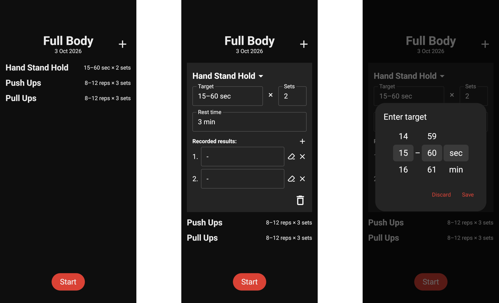
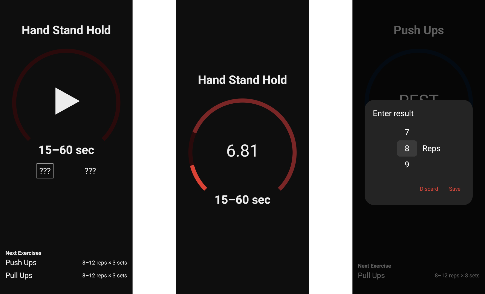

# Gym Calendar

Plan and track your workouts, even with no signal in the gym. A tool instead of a service: cloud features are optional and nothing shows up in your face that you didn't ask for.

## Features

### Plan today's workout

Set the goals for today's workout.

### Record your sets

Use the set-rest timer, or enter results directly using an effortless UI.

## In development

- Multi-week plans with [periodization](https://en.wikipedia.org/wiki/Sports_periodization)
- Progress history
- Cloud sync and plan sharing (Ktor backend)

## Architecture

- **Native Android app:** Kotlin, Jetpack Compose, Hilt, Room
- **Offline-first:** all data lives on the device and the app is fully usable without a connection, since gyms often have poor reception. Cloud sync is designed in from the start.

## About this repo

The source code is private for the time being. Happy to walk through it in private.
